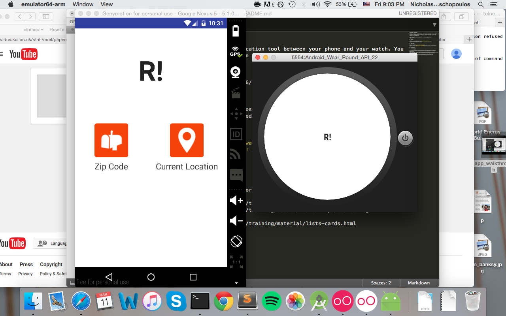
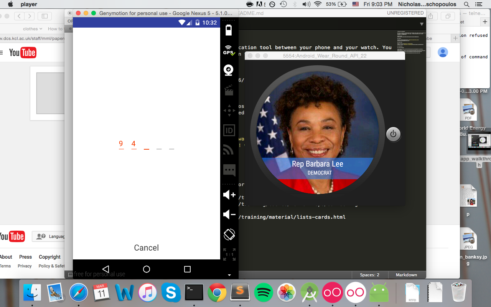
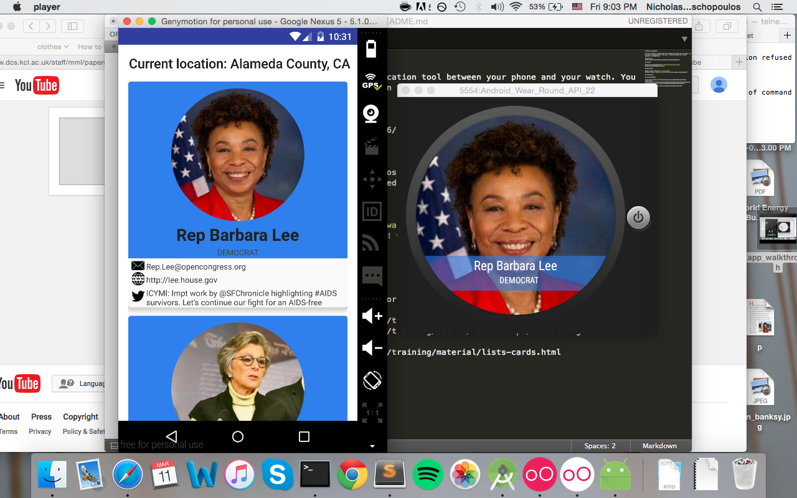
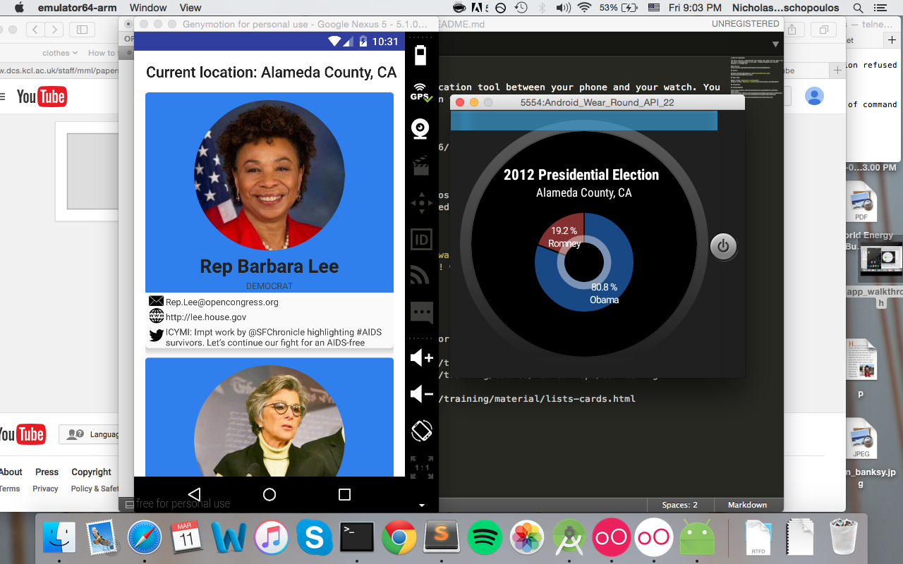
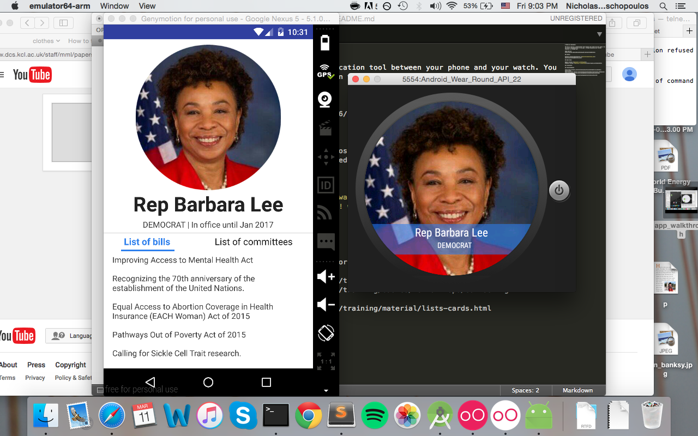

# PROG 02: Represent!

The app is used as a communication tool between your phone and your watch. You can access representatives in two ways - through accessing your current location, or through a zip code you input. I run a check to make sure that the zip code is a valid US zip by using Google geolocation data – if you input a zip code that is not based in the US, no new activity launches and you are asked to retype it.

Once you input a location, you are taken to a page with a list of representatives. Each one will be color coded by his/her political affiliation. For each reprsentative, we display email, website, and their last tweet.

This will also update on the phone with a watered down version of that – you see the image of the representative along with his/her name and party, and a banner color coded by that party.

The watch also lets you explore 2012 presidential data. If you swipe up, you see a pie chart with a breakdown of the election data, color coded also by party.

The profile of the representative displays more detailed information about the representative, including the list of bills/committees she/he has sponsored or served on.

There are two more features – you can launch a representative's profile from your watch by clicking his/her profile on the watch, and you can select a random location in the US by shaking the watch. Both features are demonstrated in the video

Code held at:
https://github.com/cs160-sp16/prog-02-represent-MosNicholas

Original design docs held here:
https://www.figma.com/file/F0I4ajOqgGxrFgs4wNpenj7I/Represent

## Authors

Nicholas Hardison-Moschopoulos ([mosnicholas@berkeley.edu](mailto:mosnicholas@berkeley.edu))

## Demo Video

Newest version: [Represent! walkthrough](https://youtu.be/vPVLLeeO6GI)
Original version: [Represent! walkthrough](https://youtu.be/7RyAVvnUTIs)

## Screenshots

## Acknowledgments

http://code.tutsplus.com/tutorials/using-the-accelerometer-on-android--mobile-22125
http://developer.android.com/training/wearables/data-layer/events.html#Listen
http://developer.android.com/training/basics/network-ops/connecting.html#AsyncTask
http://developer.android.com/training/material/lists-cards.html
